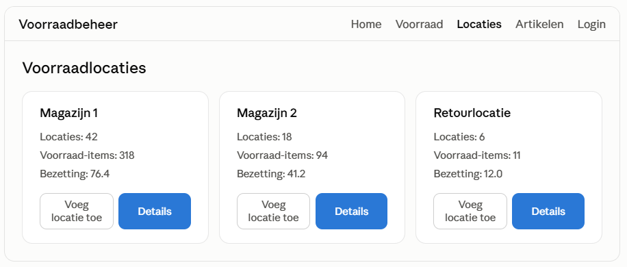
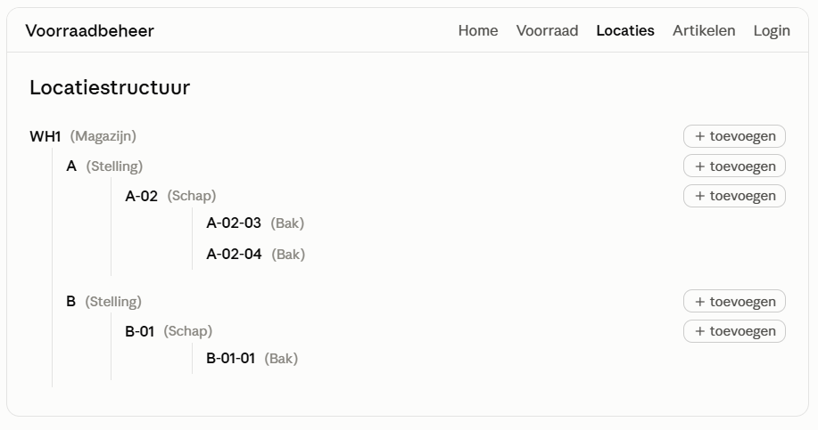
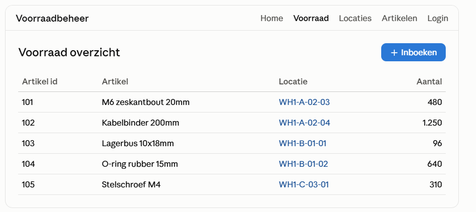

# Voorraadbeheer — Inventory Management System

A warehouse inventory management tool built with **Symfony 6.4** and **PostgreSQL/Doctrine ORM**. This project started from the official [SymfonyCasts "Space Inviters" tutorial](https://symfonycasts.com/) and was extended into a working inventory system as a way to add PHP/Symfony to a primarily Python-based skill set.

> Note: the screenshots below are UI mockups rebuilt from the project's actual Twig templates (same fields, layout and copy) with sample data, not live captures of a running instance.

## What it does

- **Hierarchical storage locations** — warehouses contain storage areas, which contain a nested tree of locations (e.g. rack → shelf → bin), each with a unique code/label and a level (`LocationLevel`) that defines where it sits in the hierarchy.
- **Stock tracking** — every stock record links an article to a specific location with a quantity, so you always know what's stored where and how much.
- **Article catalog** — basic article management (title, price) that stock records reference.
- **Location tree management** — locations can be browsed and extended as a nested tree, with the ability to add child locations directly from the tree view.
- **Storage overview** — a dashboard-style overview per storage area showing number of locations and occupancy.
- **Sales orders & customers** — early support for linking stock to outgoing sales orders.
- **Admin backend** — an [EasyAdmin](https://symfony.com/bundles/EasyAdminBundle/current/index.html) dashboard for direct CRUD access to stock data.
- **Authentication** — login/registration with Symfony Security.

## Tech stack

- PHP 8.2+, Symfony 6.4
- Doctrine ORM + Doctrine Migrations (PostgreSQL)
- Twig templates, Bootstrap 5 (Bootswatch "Quartz" theme)
- Symfony UX (Stimulus, Chart.js, Icons, Autocomplete)
- EasyAdmin for the admin backend
- Docker / Docker Compose for local development

## Data model

```
Warehouse
  └── Storage
        └── Location (tree, via LocationLevel)
              └── Stock ── Article
```

- `Location` — unique code, optional parent `Storage`, and a `LocationLevel` that encodes depth/label in the hierarchy (e.g. "Magazijn", "Stelling", "Schap", "Bak").
- `Stock` — quantity of an `Article` at a specific `Location`.
- `SalesOrder` / `Customer` / `Supplier` — support for the order side of inventory (in progress).

## Why this project

I mostly work with Python (Django, Snowflake/ETL pipelines) day to day. Building this out from a Symfony tutorial into an actual inventory tool was a way to get hands-on with a different stack (PHP/Symfony, Doctrine, server-rendered Twig + Stimulus) while working on a familiar problem domain — modeling locations, stock and quantities.

## Running locally

```bash
docker compose up -d
composer install
php bin/console doctrine:migrations:migrate
symfony server:start
```

## Screenshots






- Stock overview — articles, their location and quantity
- Location tree — nested warehouse/rack/shelf/bin structure
- Storage overview — occupancy per storage area
