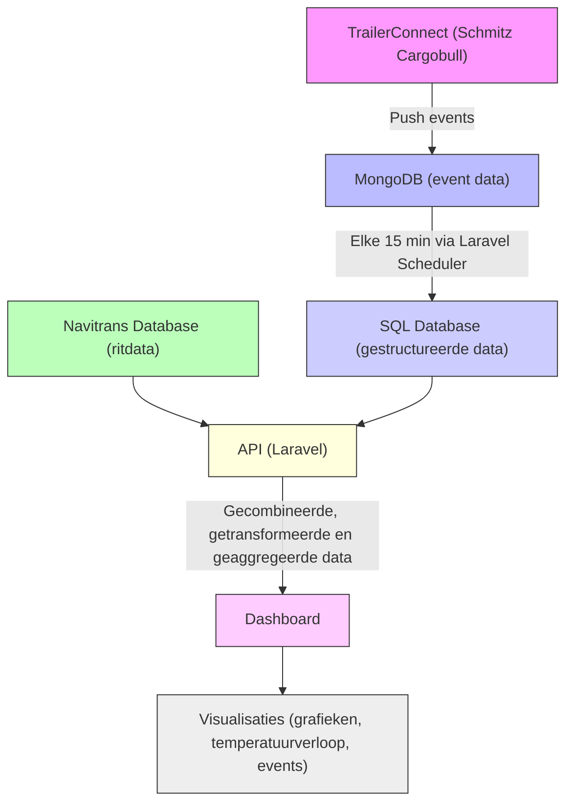

Voor een transportbedrijf heb ik gewerkt aan een dashboard waarmee we temperatuurdata uit trailers konden koppelen aan ritinformatie uit het planningssysteem Navitrans. Het doel was om inzicht te geven in de condities tijdens een rit — met name of de lading gedurende de rit binnen de juiste temperatuurgrenzen is gebleven. Dit was zowel intern belangrijk als richting de klant, als bewijs van correcte koelketenbewaking.

De temperatuurdata kwam van TrailerConnect, het telematica-platform van Schmitz Cargobull. In hun online omgeving heb ik een push service geconfigureerd die real-time data stuurt op basis van events zoals deur open, start rit, stop rit, enz. Deze data werd opgeslagen in een MongoDB, vanwege de snelheid en flexibiliteit van schema’s (de eventstructuur kon namelijk per type trailer verschillen).

Om de data bruikbaar te maken voor rapportages en dashboards, liet ik via een Laravel Scheduler elke 15 minuten de relevante gegevens overzetten naar een lokale SQL-database. Daar konden ze eenvoudiger gekoppeld worden aan de ritdata uit Navitrans (zoals rit-ID, klant, chauffeur en laad-/losinformatie).

In de API heb ik vervolgens de gecombineerde data (temperatuur, events en ritdetails) samengebracht, getransformeerd en geaggregeerd. Deze bewerkte data werd vervolgens via het dashboard gepresenteerd. Op het dashboard zelf vonden nog aanvullende bewerkingen plaats voor de visualisaties, bijvoorbeeld het plotten van temperatuurverloop over tijd of het markeren van afwijkende events.

Het geheel was ontworpen om schaalbaar en uitbreidbaar te zijn — met ruimte om de data-pijplijn later eventueel te vervangen door een meer gespecialiseerde ETL-omgeving indien nodig.

