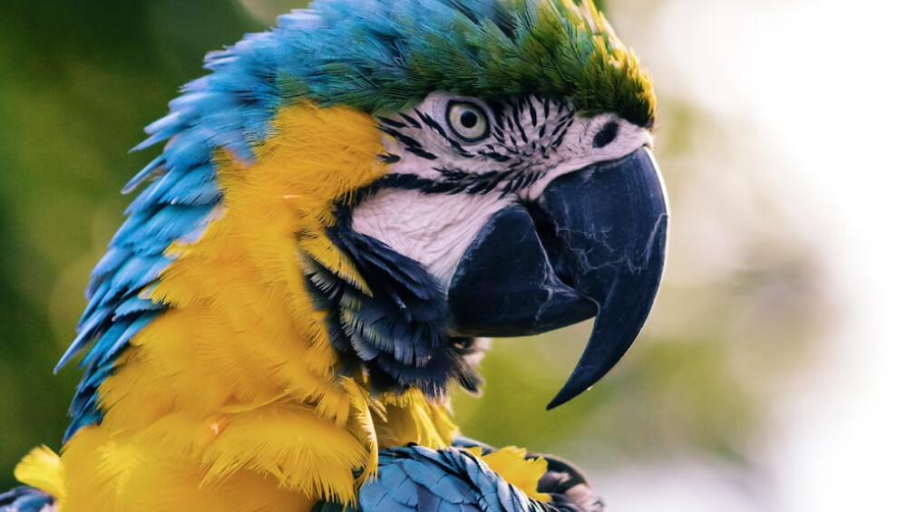

# 🌬️ Realtime Videowall voor Windparken in Nederland

## 🎯 Doel
Een dynamische visuele tool om live gegevens van windparken in Nederland te tonen op een videowall, met realtime productie-informatie en interactieve visualisaties.

## 👨‍💻 Mijn Rol
Fullstack developer met focus op datavisualisatie en dataverwerking. Ontworpen en gebouwd in opdracht van een energiebedrijf.

---

## 🔍 Functionaliteiten

- **Kaartweergave** met automatische loop langs alle windparken.
- **Windroos** per park (zie voorbeeld hieronder).
- **Teller** met rekenende animatie voor totaal opgewekte energie.
- **Realtime meters** voor huidig vermogen per park.
- **Live data** via API uit GreenByte-platform.

---

## 🧠 Dataverwerking

- **Bron**: REST API's (GreenByte, APX, locale DB)
- **Data**: Parknaam, vermogen, windsnelheid/-richting, status turbine, Spot prijsontwikkeling
- **Verwerking**: polling en caching per interval, transformatie per park
- **Visualisatie**: via D3.js in custom React-componenten, GeoJSON voor de kaart en locatie gegevens

---

## 📊 Voorbeeld Visuals

| Windroos                                  | Gauge Meter                                 |
|------------------------------------------|---------------------------------------------|
|  |   |

---

## ⚙️ Stack

- **Frontend**: React, D3.js
- **Backend**: REST API integratie
- **Visualisatie**: Custom SVG, D3, CSS-animaties, GeoJSON, MapBox

---

## ✅ Resultaat
Het dashboard biedt een aantrekkelijke manier voor publieke communicatie van energieprestaties. Het project is schaalbaar, uitbreidbaar en goed inzetbaar als basis voor latere BI-rapportages.

---

## 📌 Disclaimer
Code is eigendom van opdrachtgever en wordt hier niet gedeeld. Dit project dient ter illustratie van mijn rol en ervaring.
