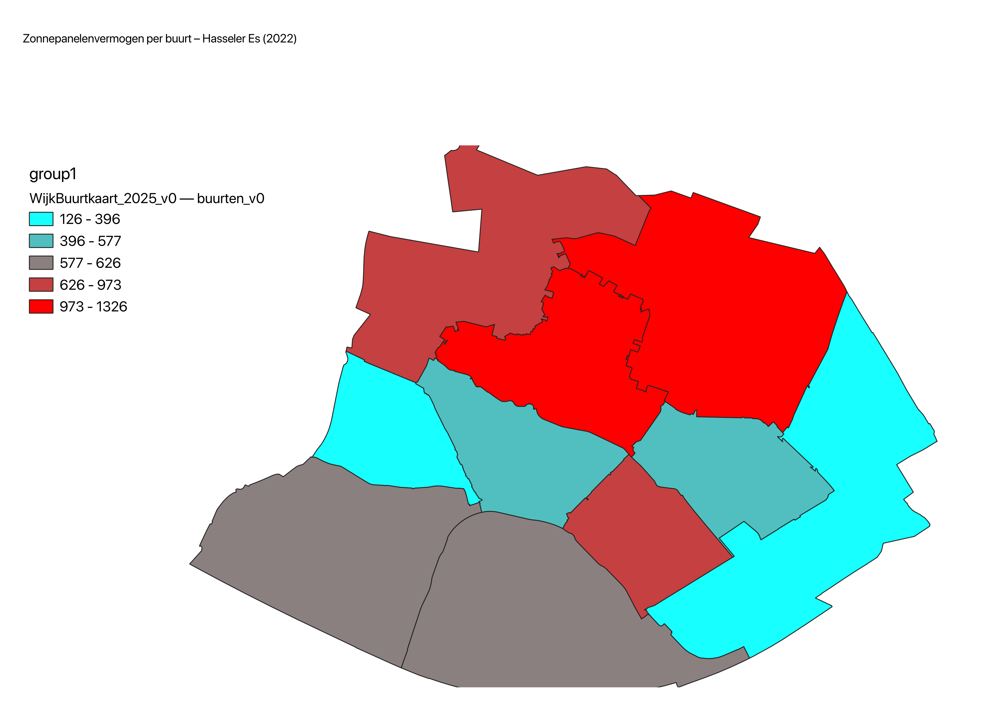
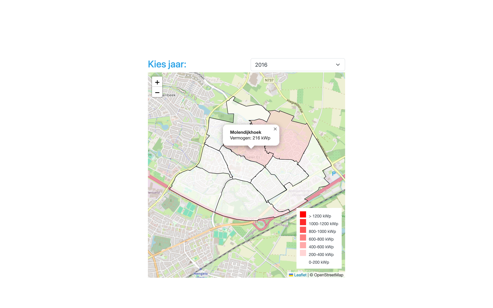
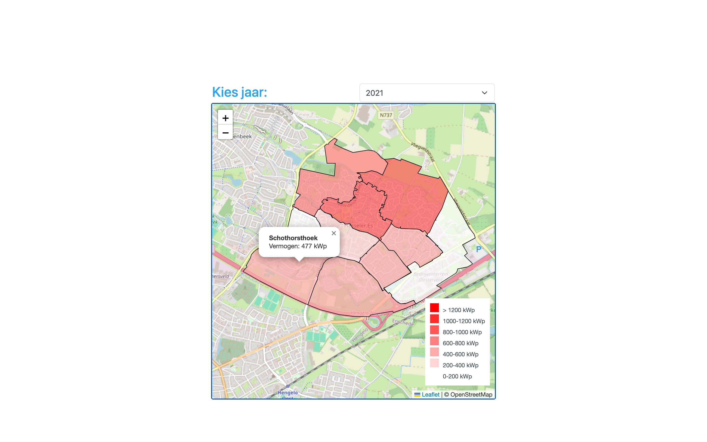

#  Overzicht van zonnepanelen in de wijk Hasseler Es

## 🔧 Doel
Inzicht krijgen in de hoeveelhied zonnepanelen in de buurten van de Hasseler Es om dit onderling inzichteljk te krijgen
## 📁 Overzicht
Zonnestroom; vermogen zonnepanelen woningen, wijken en buurten, 2016-2022 , openbare dat bronnen van het CBS, gefilters op gemeente Hengelo
Wijk- en buurtkaart 2023 van het CBS, de file bevat geometrien die ndoig zijn voor de kaart weergave

## ⚙️ Technologieën
- GIS
- QGIS
- SQL
- Meta base
- React
- Leaflet
  
## 📋 Stappenplan
1. CBS Data verzamelen
    - Zonnepanelen per buurt per jaar (2016–2022).
    - Geometrieën van wijken en buurten 2025.
2. Data voorbereiden
    - Filter zonnepanelen datasheets op Hasseler Es.
    - CSV’s per jaar maken of in één bestand houden met een jaar-kolom.
3. QGIS
    - Laad geometrie + CSV in QGIS.
    - Joinen op buurtcode.
    - Visualiseren met gegradueerde symbologie.
4. Kaart maken
    - Begin met 1 jaar (2022).
5. Uitbreiding meerdere jaren (2026-2022)
   - virtuele laag maken met per buurt de totale zonnepanelen vermogen output voor alle jaren
   - virtuele laag exporteren naar GeoJSON
   - De GeoJSON data imporeren in een Leafet component met OpenStreetMap kaart
   - Leaflet centreren op onze wijk met een goed zoom level
   - select element voor de keuze per jaar  
   
## 📐 Architectuur
<pre class="mermaid">
flowchart TD
    A[Download CBS Zonnepanelen Data 2016-2022 van de gemeente Hengelo] --> C[Opslaan als CSV per Jaar]

    D[Download CBS Wijk- en Buurtgeometrieën 2025] --> E[Laad Shapefile/GeoPackage in QGIS]
    C --> F[Laad CSV in QGIS]

    F --> G[Join CSV met Buurtgeometrie op Buurtcode]
    E --> G

    G --> H[Visualiseer in QGIS Gegradueerde symbologie]
    H --> I[Kaart voor 1 Jaar]

    I --> J[Exporteren als Afbeelding met Titel & Legenda]

    %% Verbetering naar meerdere jaren
    I --> K[Uitbreiden naar Tijdserie of Animatie per Jaar]
    K --> L[Meerdere Kaarten of Atlas per Jaar automatisch genereren]
  

    style A fill:#e3f2fd,stroke:#2196f3,stroke-width:2px
    style K fill:#f1f8e9,stroke:#8bc34a,stroke-width:2px
    style C fill:#fff3e0,stroke:#ff9800,stroke-width:2px
    style D fill:#ffe0b2,stroke:#fb8c00,stroke-width:2px
    style E fill:#fff9c4,stroke:#fbc02d,stroke-width:2px
    style F fill:#e0f7fa,stroke:#00acc1,stroke-width:2px
    style G fill:#ede7f6,stroke:#673ab7,stroke-width:2px
    style H fill:#ffcdd2,stroke:#e53935,stroke-width:2px,stroke-dasharray: 5 5
</pre>

 

### Uitbreiding interactieve kaart met jaar selectie
 
 

## 📌 Status
✅ eerste koppeling met 1 jaar aan gegevens gemaakt en geplot in een kaart met een graduele vulling die een presentatie van de hoeveelheid zonnepanelen in kWh weergeeft.
✅ Klaar om uit te breiden met een atlasfunctie of tijdserie/animatie voor meerdere jaren automatisch genereren.
🛠️ Publiceren op onze (statische) website indien mogelijk in een interactieve weergave.

